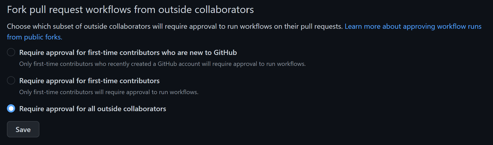

# Buildalon Activate Unity License

[](https://discord.gg/VM9cWJ9rjH) [](https://github.com/buildalon/activate-unity-license/actions/workflows/validate.yml)

A GitHub Action to activate a [Unity Game Engine](https://unity.com) license for CI/CD workflows.

## How to use

This action uses your stored environment secrets to authenticate with the Unity Licensing servers.

***It's important that you disable other forks of your repository to run actions in pull requests from unknown contributors.***

> Read more on [Approving workflow runs from public forks](
https://docs.github.com/en/actions/managing-workflow-runs/approving-workflow-runs-from-public-forks)

[](https://docs.github.com/en/repositories/managing-your-repositorys-settings-and-features/enabling-features-for-your-repository/managing-github-actions-settings-for-a-repository)

### inputs

This action requires several secrets that need to be setup in the repository or organization's action secret store.

* `UNITY_USERNAME`: The email address you use for your Unity Id.
* `UNITY_PASSWORD`: The password you use for Unity Id access.
* `UNITY_SERIAL`: The Serial number for the seat.
* `UNITY_SERVICES_CONFIG`: Unity License Client `services-config.json` encoded as base64 string.

> [!IMPORTANT]
> Don't forget that Professional licenses only support 2 activations at a time!

| name | description | required |
| ---- | ----------- | -------- |
| `license` | Must be one of `Personal`, `Professional`, or `Floating` | Defaults to `Personal` |
| `username` | The email address you use for your Unity Id | Required for `Personal` and `Professional` license activations |
| `password` | The password you use for Unity Id access | Required for `Personal` and `Professional` license activations |
| `serial` | The Serial number for the seat | Required for `Professional` license activations |
| `configuration` | Unity License Client `services-config.json` encoded as base64 string | Required for `Floating` license activations |

### workflow

```yaml
steps:
  - uses: buildalon/activate-unity-license@v1
    with:
      license: 'Personal' # Choose license type to use [ Personal, Professional, Floating ]
      username: ${{ secrets.UNITY_USERNAME }}
      password: ${{ secrets.UNITY_PASSWORD }}
      # serial: ${{ secrets.UNITY_SERIAL }} # Required for pro activations
      # configuration: ${{ secrets.UNITY_SERVICES_CONFIG }} # Required for floating license activations
```
